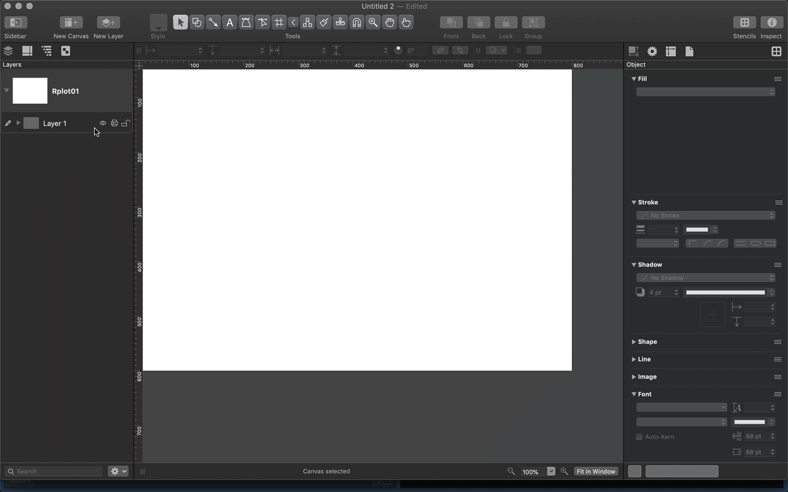
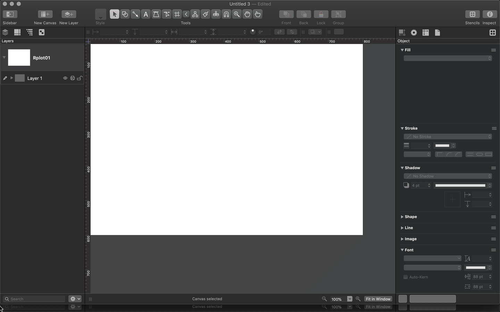

# graffle

An 'OmniGraffle' Graphics Device [WIP]

## Description

A graphics device that produces 'OmniGraffle' documents. 
Currently based on the code structure of the 'svglite' package.

## What's Inside The Tin

The following functions are implemented:

- `graffle`: A graphics device that produces 'OmniGraffle' documents

## NOTE

This is a WIP but it may still be useful to some folks. The pacakge (perhaps somewhat obviously) requires that you have OmniGraffle installed.

It also requires that you have it open and &mdash; for the moment &mdash; have at least one document window open. It relies on the [Omni Automation API](https://omni-automation.com/omnigraffle/) and "draws" directly in a new document.

Eventually it will not be necessary to have OmniGraffle already open or also have a document open to make this work.

Since it's instrumenting an application to draw, it's also not super-speedy. Yay for closed document formats?

## TODO

- Fix need to have OG up and an existing or new doc open
- Text/fonts
- Tests

## Installation

```{r eval=FALSE}
devtools::install_git("https://git.sr.ht/~hrbrmstr/graffle")
# OR 
devtools::install_gitlab("hrbrmstr/graffle")
# OF 
devtools::install_github("hrbrmstr/graffle")
```

```{r message=FALSE, warning=FALSE, error=FALSE, include=FALSE}
options(width=120)
```

## Usage

```{r message=FALSE, warning=FALSE, error=FALSE}
library(graffle)

# current verison
packageVersion("graffle")

```

### Base graphics

```{r eval=FALSE}
graffle()
plot(
  cars, main = "Stopping Distance versus Speed",
  col = "red", cex = 3
)
lines(stats::lowess(cars), col = "blue")
dev.off()
```



### ggplot2

```{r eval=FALSE}
graffle()
ggplot(mpg, aes(displ, hwy)) +
  geom_point(aes(color = drv)) +
  facet_wrap(vars(cyl, drv))
dev.off()
```



## `graffle` Metrics

```{r cloc, echo=FALSE}
cloc::cloc_pkg_md()
```

## Code of Conduct

Please note that the 'graffle' project is released with a [Contributor Code of Conduct](CODE_OF_CONDUCT.md). By contributing to this project, you agree to abide by its terms.